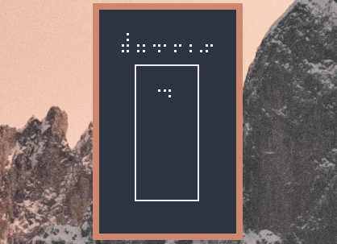

# `⣼⢠⡄⢤⠄⡤⢠⢀⡤`

Mini Tetris made with dots



## How To Play

Key           | Description
---           | ---
`Left Arrow`  | Move left
`Right Arrow` | Move right
`Up Arrow`    | Rotate clockwise
`Down Arrow`  | Soft drop (move down)
`Spacebar`    | Hard drop
'C'           | Hold Tetrimino / Restore Held
`Q`           | Quit game

## Mechanics

### Scoring

The scoring is based on the BPS version of Tetris:

Lines      | Points
---        | ---
1          | 40
2          | 100
3          | 300
4 (tetris) | 1200

If the piece used to clear was hard dropped you get 1 point per row added to the point amount.

Each level acts as a multiplier to the above table. i.e on level two, clearing one line is 80;

### Levels

Every 10 lines cleared the speed of the falling piece increases by 40% and the grid is wiped.

## Building

```
git clone https://github.com/trevarj/dotris && cd dotris
```

### GCC

```
gcc -lncursesw -Iinclude/ src/main.c src/tetriminos.c src/grid.c -o dotris
```

### Meson (Clang)
meson setup ./build . --buildtype=release
cd build
meson compile
```

Now you can run the `dotris` binary

```
./dotris
```

